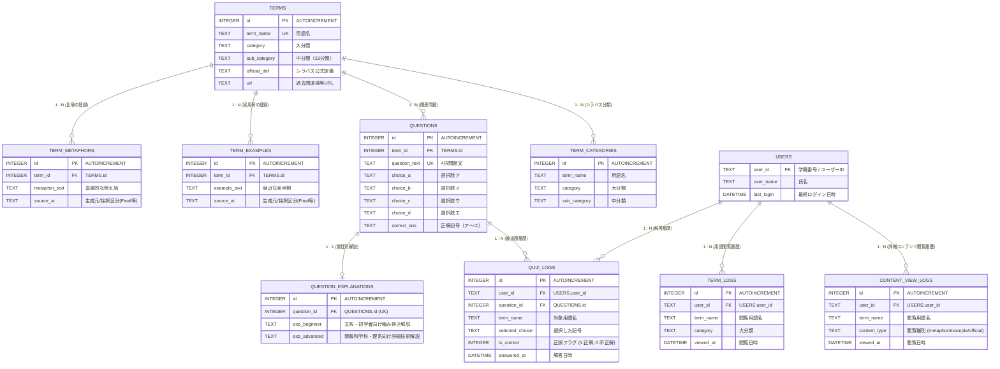

# FE-AI Tutor データベース論理設計（ER図）

```mermaid
erDiagram
    TERMS ||--o{ TERM_METAPHORS : "1 : N (比喩の登録)"
    TERMS ||--o{ TERM_EXAMPLES : "1 : N (実用例の登録)"
    TERMS ||--o{ QUESTIONS : "1 : N (関連問題)"
    TERMS ||--o{ TERM_CATEGORIES : "1 : N (シラバス分類)"
    
    QUESTIONS ||--o| QUESTION_EXPLANATIONS : "1 : 1 (属性別解説)"
    
    USERS ||--o{ QUIZ_LOGS : "1 : N (解答履歴)"
    QUESTIONS ||--o{ QUIZ_LOGS : "1 : N (被出題履歴)"
    
    USERS ||--o{ TERM_LOGS : "1 : N (用語閲覧履歴)"
    USERS ||--o{ CONTENT_VIEW_LOGS : "1 : N (詳細コンテンツ閲覧履歴)"

    TERMS {
        INTEGER id PK "AUTOINCREMENT"
        TEXT term_name UK "用語名"
        TEXT category "大分類"
        TEXT sub_category "中分類（23分類）"
        TEXT official_def "シラバス公式定義"
        TEXT url "過去問道場等URL"
    }

    TERM_METAPHORS {
        INTEGER id PK "AUTOINCREMENT"
        INTEGER term_id FK "TERMS.id"
        TEXT metaphor_text "直感的な例え話"
        TEXT source_ai "生成元/採択区分(Final等)"
    }

    TERM_EXAMPLES {
        INTEGER id PK "AUTOINCREMENT"
        INTEGER term_id FK "TERMS.id"
        TEXT example_text "身近な実用例"
        TEXT source_ai "生成元/採択区分(Final等)"
    }

    QUESTIONS {
        INTEGER id PK "AUTOINCREMENT"
        INTEGER term_id FK "TERMS.id"
        TEXT question_text UK "4択問題文"
        TEXT choice_a "選択肢ア"
        TEXT choice_b "選択肢イ"
        TEXT choice_c "選択肢ウ"
        TEXT choice_d "選択肢エ"
        TEXT correct_ans "正解記号（ア〜エ）"
    }

    QUESTION_EXPLANATIONS {
        INTEGER id PK "AUTOINCREMENT"
        INTEGER question_id FK "QUESTIONS.id (UK)"
        TEXT exp_beginner "文系・初学者向け噛み砕き解説"
        TEXT exp_advanced "情報科学科・理系向け詳細技術解説"
    }

    TERM_CATEGORIES {
        INTEGER id PK "AUTOINCREMENT"
        TEXT term_name "用語名"
        TEXT category "大分類"
        TEXT sub_category "中分類"
    }

    USERS {
        TEXT user_id PK "学籍番号 / ユーザーID"
        TEXT user_name "氏名"
        DATETIME last_login "最終ログイン日時"
    }

    QUIZ_LOGS {
        INTEGER id PK "AUTOINCREMENT"
        TEXT user_id FK "USERS.user_id"
        INTEGER question_id FK "QUESTIONS.id"
        TEXT term_name "対象用語名"
        TEXT selected_choice "選択した記号"
        INTEGER is_correct "正誤フラグ (1:正解, 0:不正解)"
        DATETIME answered_at "解答日時"
    }

    TERM_LOGS {
        INTEGER id PK "AUTOINCREMENT"
        TEXT user_id FK "USERS.user_id"
        TEXT term_name "閲覧用語名"
        TEXT category "大分類"
        DATETIME viewed_at "閲覧日時"
    }

    CONTENT_VIEW_LOGS {
        INTEGER id PK "AUTOINCREMENT"
        TEXT user_id FK "USERS.user_id"
        TEXT term_name "閲覧用語名"
        TEXT content_type "閲覧種別 (metaphor/example/official)"
        DATETIME viewed_at "閲覧日時"
    }
```